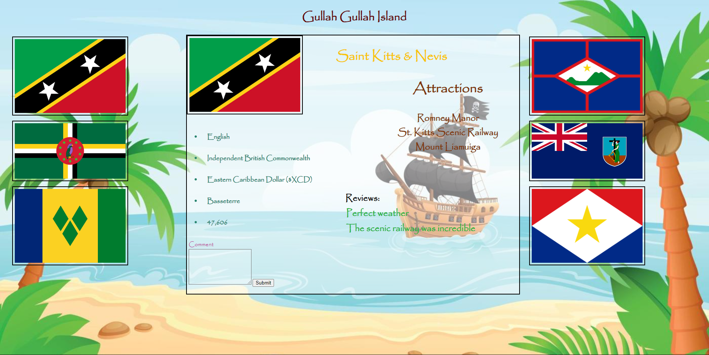

Gullah Gullah Island
Gullah Gullah Island is a website designed to bring awareness to some of the lesser visited islands in the Caribbean. These islands offer lush, abundant vegetation, pristine mountain ranges, fantastic snorkeling and scuba diving, an immersive nightlife, and much more, yet they are not as well known as some of their more famous neighbors. The goal of this site is to change the perspective on these places, and to make them more enticing for prospective visitors.

The Islands:
To render the islands on the page, we utilized a click event on the flags to the right and left of the transparent box. When clicked, these flags display several points of data regarding the specific island, including the capital, population amount, currency used, and primary language spoken. There will also be an "Attractions" portion rendered, which will list the hotspots of each island.
The Comment Box:
There will be a comment box in the lefthand corner of the rendered data that will allow users to submit reviews of the places visited. The reviews will appear below the "Attractions" information and new reviews will append to the reviews that already appear.

Sound Effects:
There will be multiple sound events used on the site. The first will be a soundbite of the "Island Boi" viral song. This will play after a comment has been submitted to let the user know their review was uploaded. The second soundbite will be an islkand intro song that will being playing when the "Gullah Gullah Island" banner is hovered over.
Creators and Contributors:
Umarbek, Elisabeth, and Andrew.

